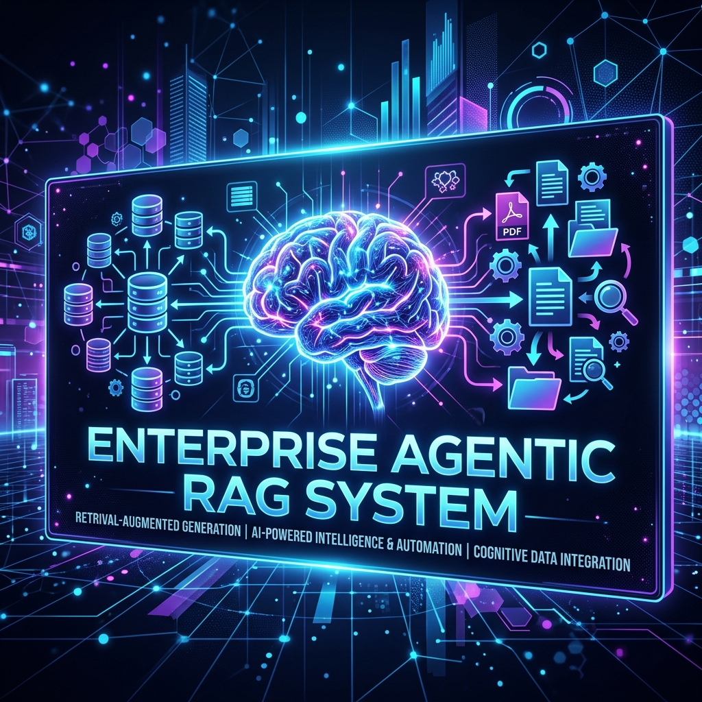
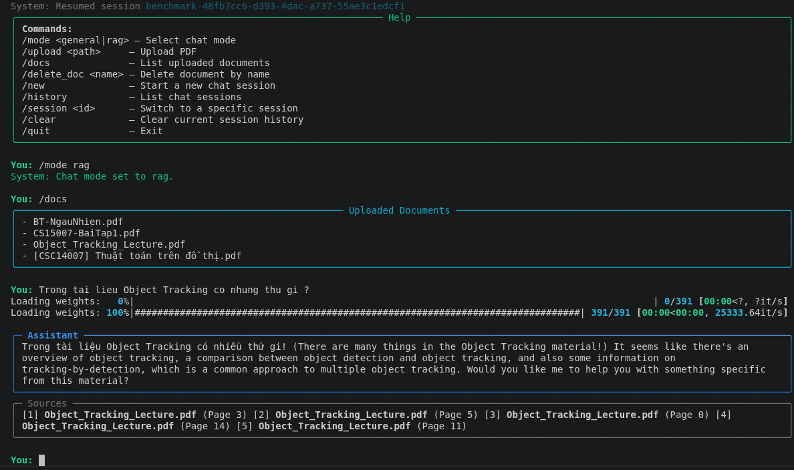

<div align="center">
  

  <h1>Enterprise Agentic RAG Chatbot</h1>

  <p>
    <strong>Production-minded chatbot hỏi đáp tài liệu nội bộ với RAG, Local LLM, LangGraph, FastAPI và React/Vite.</strong>
  </p>

  <p>
    <a href="LICENSE"></a>
    
    
    
    
    
  </p>

  <p>
    <a href="#tổng-quan">Tổng quan</a> •
    <a href="#tính-năng">Tính năng</a> •
    <a href="#kiến-trúc">Kiến trúc</a> •
    <a href="#cài-đặt">Cài đặt</a> •
    <a href="#cicd--deploy">CI/CD</a> •
    <a href="#kiến-thức-đã-học">Kiến thức đã học</a>
  </p>
</div>

---

## Tổng Quan

**Enterprise Agentic RAG Chatbot** là một hệ thống chatbot hỏi đáp tài liệu nội bộ được xây dựng theo hướng gần production. Project kết hợp **Retrieval-Augmented Generation**, **agentic routing**, **conversation memory**, **FastAPI backend**, **React/Vite frontend**, Docker và CI/CD để tạo thành một workflow hoàn chỉnh từ ingest PDF đến deploy.

Dự án được triển khai dựa trên kế hoạch trong [PROJECT_PLAN.md](PROJECT_PLAN.md). Trong quá trình làm, một số lựa chọn đã được cập nhật theo thực tế triển khai, ví dụ frontend hiện dùng **React/Vite** thay vì Streamlit để phù hợp hơn với Vercel và UI dạng web app.

<div align="center">
  
  <br />
  <sub>CLI demo: upload tài liệu, chat theo session và hiển thị nguồn tham chiếu.</sub>
</div>

---

## Tính Năng

### Đã Hoàn Thành

- **PDF ingestion**: load PDF, tách chunk, giữ metadata `source` và `page`.
- **Vector search**: embedding bằng `BAAI/bge-m3`, lưu và truy vấn bằng ChromaDB.
- **RAG answering**: retrieve context, ghép prompt, sinh câu trả lời bằng Ollama local LLM hoặc cloud model.
- **Multi-provider LLM**: chọn model từ UI giữa Ollama, Gemini, OpenAI và Groq.
- **Agentic routing**: phân loại câu hỏi thành `INTERNAL_DOC` hoặc `GENERAL_CHAT`.
- **LangGraph agent flow**: gom router, retrieval, generation và memory thành graph.
- **Conversation memory**: lưu session, chuyển session, tiếp tục phiên cũ.
- **Re-ranking**: hỗ trợ `BAAI/bge-reranker-v2-m3` cho two-stage retrieval.
- **CLI app**: upload/list/delete document, chat, session history.
- **FastAPI backend**: `/health`, `/models`, `/chat`, `/upload`, `/documents`, `/sessions`.
- **React/Vite frontend**: chat UI, upload PDF, quản lý documents và sessions.
- **Docker support**: `Dockerfile.api`, `Dockerfile.ui`, `docker-compose.yml`.
- **CI/CD**: GitHub Actions test/build, Render backend deploy, Vercel frontend deploy.
- **QA dataset generation**: script sinh QA và rewrite văn phong trong `scripts/generate_qa.py`.
- **Automated tests**: pytest cho RAG components và agent router.

### Đang Mở Rộng

- Fine-tuning LoRA/Unsloth trong `scripts/finetune.py`.
- RAGAS evaluation trong `scripts/evaluate.py`.
- Streaming response, Qdrant migration, hybrid search, auth và admin dashboard.

---

## Tech Stack

| Layer | Công nghệ | Vai trò |
| --- | --- | --- |
| LLM Runtime | Ollama | Chạy model local |
| Agent Orchestration | LangGraph | Điều phối routing, RAG và memory |
| RAG Framework | LangChain | Document abstraction, retrieval workflow |
| Embedding | `BAAI/bge-m3` | Sinh vector đa ngôn ngữ |
| Re-ranker | `BAAI/bge-reranker-v2-m3` | Cross-encoder relevance scoring |
| Vector DB | ChromaDB | Lưu vector cục bộ |
| Backend | FastAPI, Pydantic | REST API và schema validation |
| Frontend | React, Vite, Lucide | Web chat interface |
| CLI | Rich | Terminal UX |
| Infra | Docker, Docker Compose | Container hóa local/prod |
| CI/CD | GitHub Actions, Render, Vercel | Test, build, deploy tự động |

---

## Kiến Trúc

```text
┌─────────────────────────────────────────────────────────┐
│ Interfaces                                              │
│  CLI: main_cli.py      Web UI: React/Vite               │
└───────────────┬───────────────────────────────┬─────────┘
                │                               │
                ▼                               ▼
┌─────────────────────────────────────────────────────────┐
│ FastAPI Backend                                         │
│  /health /chat /upload /documents /sessions             │
└──────────────────────────────┬──────────────────────────┘
                               ▼
┌─────────────────────────────────────────────────────────┐
│ LangGraph Agent                                         │
│  Router -> RAG or General Chat -> Memory -> Response    │
└──────────────────────────────┬──────────────────────────┘
                               ▼
┌─────────────────────────────────────────────────────────┐
│ RAG Pipeline                                            │
│  PDF Loader -> Chunking -> Embedding -> ChromaDB        │
│  Semantic Search -> Optional Re-ranking -> LLM Prompt   │
└──────────────────────────────┬──────────────────────────┘
                               ▼
┌─────────────────────────────────────────────────────────┐
│ Local LLM Runtime                                       │
│  Ollama model, default from .env                        │
└─────────────────────────────────────────────────────────┘
```

### Nguyên Tắc Thiết Kế

- **Layered architecture**: `core` -> `rag` -> `agent` -> `api/ui`.
- **Config-driven**: `.env` + `pydantic-settings` quản lý cấu hình tập trung.
- **Lazy initialization**: model nặng chỉ load khi cần.
- **Service abstraction**: LLM, vector store, retriever được bọc qua module riêng.
- **Production thinking**: schema rõ ràng, error handling, Docker, CI/CD và deploy tách service.

---

## Cấu Trúc Dự Án

```text
.
├── src/
│   ├── core/              # Config, logger, exceptions, LLM client
│   ├── rag/               # PDF loading, embedding, vector store, retriever, reranker
│   ├── agent/             # State, router, LangGraph graph, memory, tools
│   └── api/               # FastAPI app, routes, schemas, dependencies
├── ui/
│   ├── src/               # React app
│   ├── vite.config.js     # Local proxy / preview proxy
│   ├── nginx.conf         # Docker UI config
│   └── vercel.json        # Vercel config nếu Root Directory là ui
├── scripts/
│   ├── generate_qa.py     # Sinh QA dataset từ PDF/HF dataset
│   ├── finetune.py        # TODO: LoRA/Unsloth fine-tuning
│   └── evaluate.py        # TODO: RAGAS evaluation
├── tests/                 # Pytest unit tests
├── main_cli.py            # CLI entry point
├── Dockerfile.api
├── Dockerfile.ui
├── docker-compose.yml
├── vercel.json            # Vercel config nếu Root Directory là repo root
├── PROJECT_PLAN.md
├── LICENSE
└── README.md
```

---

## Cài Đặt

### Prerequisites

- Python 3.10+
- Node.js 22+
- Ollama đang chạy local
- Linux/macOS hoặc WSL được khuyến nghị

### Python Environment

```bash
python -m venv .venv
source .venv/bin/activate
python -m pip install --upgrade pip
pip install -e ".[dev]"
```

Nếu dùng `uv`:

```bash
uv sync --extra dev
```

### Environment Variables

```bash
cp .env.example .env
```

Các biến quan trọng:

```env
OLLAMA_BASE_URL=http://localhost:11434
OLLAMA_MODEL=llama3
DEFAULT_LLM_PROVIDER=ollama
OPENAI_API_KEY=
GOOGLE_API_KEY=
GEMINI_API_KEY=
OPENAI_MODEL=gpt-5.4-mini
GEMINI_MODEL=gemini-flash-latest
EMBEDDING_MODEL=BAAI/bge-m3
CHROMA_PERSIST_DIR=./data/vector_db
CHROMA_COLLECTION=documents
TOP_K=5
RERANKER_MODEL=BAAI/bge-reranker-v2-m3
RERANKER_TOP_N=3
API_HOST=0.0.0.0
API_PORT=8000
```

Pull model Ollama:

```bash
ollama pull llama3
```

---

## Chạy Project

### CLI

```bash
python main_cli.py
```

Các lệnh trong CLI:

| Command | Mô tả |
| --- | --- |
| `/upload <path>` | Upload và ingest PDF |
| `/docs` | Xem tài liệu đã ingest |
| `/delete_doc <name>` | Xóa tài liệu khỏi vector store |
| `/new` | Tạo chat session mới |
| `/history` | Xem danh sách session |
| `/session <id>` | Chuyển session |
| `/clear` | Xóa lịch sử session hiện tại |
| `/quit` | Thoát |

### Backend API

```bash
uvicorn src.api.main:app --host 0.0.0.0 --port 8000
```

Endpoints chính:

| Method | Endpoint | Mục đích |
| --- | --- | --- |
| `GET` | `/health` | Kiểm tra trạng thái API |
| `GET` | `/models` | Danh sách provider/model cho UI |
| `POST` | `/chat` | Gửi câu hỏi và nhận câu trả lời RAG |
| `POST` | `/upload` | Upload PDF và ingest vào vector DB |
| `GET` | `/documents` | Liệt kê tài liệu đã ingest |
| `DELETE` | `/documents/{source_name}` | Xóa tài liệu |
| `GET` | `/sessions` | Liệt kê chat sessions |
| `GET` | `/sessions/{session_id}` | Xem chi tiết session |
| `DELETE` | `/sessions/{session_id}` | Xóa session |

Ví dụ:

```bash
curl -X POST http://localhost:8000/chat \
  -H "Content-Type: application/json" \
  -d '{"message":"Tài liệu này nói về gì?","session_id":"demo","top_k":5}'
```

### Frontend React/Vite

```bash
cd ui
npm ci
npm run dev
```

Mặc định local UI gọi `/api` qua Vite proxy. Nếu muốn trỏ thẳng tới backend khác:

```bash
VITE_API_BASE_URL=http://localhost:8000 npm run dev
```

### Docker Compose

```bash
docker compose up --build
```

Sau khi chạy:

- API dùng network host để kết nối Ollama local.
- UI chạy tại `http://localhost:3000`.
- Dữ liệu persistent nằm trong `./data`.
- Compose khởi động UI sau khi `/ready` xác nhận API có thể nhận request. Model, LangGraph, Chroma và embedding chỉ load khi endpoint đầu tiên cần dùng, sau đó được cache.

### Readiness và benchmark

Kiểm tra API process đã sẵn sàng nhận request (không trigger model loading):

```bash
curl http://localhost:8000/ready
```

Chạy benchmark startup, danh sách session và chat latency (min/mean/p50/p95/max):

```bash
python scripts/benchmark_api.py --requests 10 --warmup 1 --concurrency 1

# Concurrent load + regression gates
python scripts/benchmark_api.py --requests 20 --concurrency 4 --max-p95-ms 30000 --max-error-rate 0
```

Các mặc định hiệu năng trong `.env.example` tắt hai lượt LLM phụ cho reformulation và intent classification. Bật lại nếu cần chất lượng hội thoại follow-up cao hơn:

```env
ENABLE_LLM_QUERY_REFORMULATION=true
ENABLE_LLM_INTENT_CLASSIFICATION=true
```

---

## Testing

Chạy toàn bộ test suite:

```bash
pytest
```

Chạy từng nhóm test:

```bash
pytest tests/test_rag/test_document.py
pytest tests/test_rag/test_embedding.py
pytest tests/test_rag/test_retriever.py
pytest tests/test_agent/test_router.py
```

---

## CI/CD & Deploy

Workflow chính: [.github/workflows/ci-cd.yml](.github/workflows/ci-cd.yml)

Pipeline hiện tại:

1. **Test**: cài Python deps, chạy `pytest`, cài UI deps, build React UI.
2. **Deploy Backend**: trigger Render deploy hook.
3. **Deploy Frontend**: build/deploy Vercel bằng Vercel CLI.

GitHub Actions secrets cần có:

```text
RENDER_DEPLOY_HOOK_URL=...
VERCEL_TOKEN=...
VERCEL_ORG_ID=...
VERCEL_PROJECT_ID=...
VITE_API_BASE_URL=https://your-render-backend.onrender.com
```

Lưu ý deploy:

- `VITE_API_BASE_URL` phải là URL public của FastAPI backend, không phải Render deploy hook.
- Nếu deploy public không chạy được Ollama local, phương án an toàn nhất là đặt `DEFAULT_LLM_PROVIDER=gemini` hoặc `DEFAULT_LLM_PROVIDER=openai` trên Render và thêm API key trong Render environment.
- Nếu người dùng tự nhập API key trên UI, key chỉ được giữ trong memory của tab hiện tại và gửi theo từng request `/chat`; frontend không lưu key vào `localStorage`, backend không lưu key vào DB/session/vector store.
- Backend Render và frontend Vercel là 2 service riêng.
- Backend đã cấu hình CORS cho Vercel domains trong `src/api/main.py`.
- Nếu Vercel Root Directory là repo root, dùng `vercel.json` ở root.
- Nếu Vercel Root Directory là `ui`, dùng `ui/vercel.json`.

---

## Kiến Thức Đã Học

### RAG Pipeline

- Tách PDF thành chunks có metadata để trace nguồn.
- Điều chỉnh chunk size, overlap và top_k ảnh hưởng trực tiếp đến chất lượng trả lời.
- Embedding giúp chuyển text search sang semantic search.
- Context phải được prompt rõ ràng để giảm hallucination.

### Retrieval & Re-ranking

- Semantic search nhanh nhưng có thể đưa kết quả chưa tối ưu lên đầu.
- Two-stage retrieval giúp cân bằng tốc độ và độ chính xác.
- Cross-encoder re-ranker chính xác hơn nhưng tốn compute hơn.
- Production system cần fallback khi reranker hoặc model load lỗi.

### Agentic Workflow

- Không phải câu hỏi nào cũng cần truy xuất tài liệu.
- Router giúp tách general chat và internal document QA.
- LangGraph giúp biểu diễn flow bằng state machine dễ mở rộng.
- Memory/session giúp chatbot xử lý follow-up question tự nhiên hơn.

### Backend & API

- FastAPI + Pydantic tạo contract rõ giữa frontend và backend.
- Dependency injection giúp quản lý LLM, vector store, memory và settings sạch hơn.
- CORS và API base URL là vấn đề bắt buộc khi deploy frontend/backend khác domain.

### Frontend & Deployment

- React/Vite cần `VITE_*` env vars tại build time.
- Local proxy và production API URL là 2 cơ chế khác nhau.
- SPA deploy lên Vercel cần rewrite về `index.html` để tránh 404 khi refresh.
- CI/CD cần test backend và build frontend trước khi deploy.

### Fine-tuning & Evaluation

- Đã chuẩn bị pipeline sinh QA dataset dạng instruction/input/output.
- Đã hiểu phần còn thiếu cho full lifecycle: LoRA training, model export và RAGAS evaluation.

---

## Roadmap

- [ ] Hoàn thiện `scripts/finetune.py` với Unsloth/LoRA.
- [ ] Hoàn thiện `scripts/evaluate.py` với RAGAS metrics.
- [ ] Thêm streaming response từ FastAPI sang frontend.
- [ ] Migrate ChromaDB sang Qdrant khi cần scale.
- [ ] Thêm hybrid search BM25 + dense retrieval.
- [ ] Thêm auth/JWT và multi-user session isolation.
- [ ] Thêm dashboard quản lý documents và metrics.

---

## License

Distributed under the [MIT License](LICENSE). See `LICENSE` for more information.

---

<div align="center">
  <sub>Built as a learning project for production-minded Agentic RAG systems.</sub>
</div>
